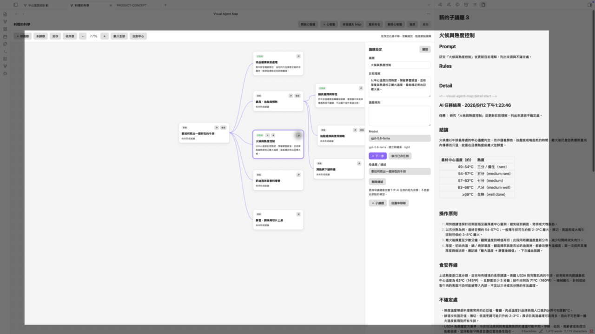

# Visual Agent Map

Turn complex questions into a visual research map while keeping every result in editable Markdown.

[English](#english) · [繁體中文](#繁體中文)


## English

Visual Agent Map is a desktop-only Obsidian plugin for breaking a broad question into connected topics, running focused Codex tasks, and preserving the results as ordinary Markdown notes. The map shows structure and current understanding at a glance; notes remain readable, editable, and portable without the plugin.

This project is developed with [OpenAI Codex](https://openai.com/codex/) as a coding collaborator. Product direction, design decisions, validation, and releases are managed by the maintainer.

### Highlights

- **Visual topic map** — create topics and subtopics, drag nodes, collapse branches, zoom, and change parent relationships.
- **Focused topic workspace** — keep current understanding, reusable AI rules, and the next task beside each topic.
- **Codex-assisted research** — research, compare options, check risks, propose subtopics, or synthesize findings.
- **Markdown-first storage** — each topic is a normal Markdown note; the map structure is stored in `Map.md`.
- **Knowledge organization** — remove notes from a map without deleting them; reclaim, archive, or move them later.
- **Safer editing** — previewed migration, conflict handling, and session undo/redo protect existing work.
- **Built-in sample** — explore a read-only Taiwan travel map, then duplicate it into an editable workspace.
- **Debug log** — inspect, copy, or clear VAM runtime diagnostics from the Command Palette.
- **Local credentials** — uses locally signed-in Codex tools and never stores API keys.



### How it works

1. Create a mind map for a research subject.
2. Add topics and subtopics to define the questions to answer.
3. Choose and confirm a focused Codex task.
4. Review the summary on the map and the full Markdown detail.
5. Continue research or synthesize related findings into a new topic.

### What's new in 0.7.0

- A rebuilt installation guide covers both Obsidian Community plugins and manual GitHub Release installation through the first editable map.
- The built-in sample now shows whether Codex is ready and gives the correct next action.
- If Codex CLI is missing, VAM opens an in-product setup guide with the official installation link, ChatGPT sign-in steps, and a recheck action.
- Before the first AI task, VAM explains once that the task uses the signed-in account's Codex allowance.

See [CHANGELOG.md](CHANGELOG.md) for the complete version history.

### Requirements

- Obsidian desktop `1.13.7` or later (the verified compatibility baseline for this release).
- A local [Codex CLI](https://developers.openai.com/codex/cli/) installation signed in with ChatGPT. ChatGPT Free is supported with a smaller Codex allowance. Visual Agent Map does not require an API key; npm is only needed to build from source.
- Desktop only. Current release: `0.9.1` (rollback to the `0.8.1` feature set).

### Install

Install **Visual Agent Map** from Obsidian's Community plugins browser. For manual installation, download `main.js`, `manifest.json`, and `styles.css` from the same [GitHub Release](https://github.com/kevcltsai/visual-agent-map/releases); do not install from a branch.

1. Create `<your-vault>/.obsidian/plugins/visual-agent-map/`.
2. Place the three release assets in that folder, preserving an existing `data.json`.
3. Reload Obsidian and enable **Visual Agent Map** under **Settings → Community plugins**.
4. Confirm the Codex CLI path and App Server status in plugin settings.

Do not copy the repository or run `npm install` inside the plugin directory. Follow [INSTALL.md](INSTALL.md) for the complete first-use journey.

### Vault data

```text
Agent Workspace/
├── Topics/
│   └── <topic>/
│       ├── Map.md
│       ├── Notes/
│       ├── Unassigned/
│       └── Archive/
└── Inbox/
```

Plugin-created content stays in the vault. A fresh installation creates the empty workspace structure and opens the read-only built-in sample; uninstalling the plugin does not delete workspace content.

### Privacy and network access

- No telemetry and no stored API keys.
- Before the first AI task, VAM shows a one-time notice that the task uses the signed-in account's Codex allowance. Relevant topic content, instructions, and the task are then sent to the locally signed-in Codex tool.
- The plugin starts `codex app-server` outside the vault with read-only sandboxing and no command or file-change approvals; it never installs or updates Codex CLI.
- Remote images in Markdown follow Obsidian's ordinary image-loading behavior.

### Current limitations

- Desktop only; available through the Obsidian Community Plugin catalog.
- No automatic layout, node search, multiple parents, or persistent task history.
- Undo/redo lasts for the current Obsidian session.

### Build from source

Run `npm ci`, `npm run build`, and `npm test` at the repository root. The production assets are `main.js`, `manifest.json`, and `styles.css`.

---

## 繁體中文

Visual Agent Map 是桌面版 Obsidian 外掛：用視覺化心智圖拆解複雜問題、執行聚焦的 Codex 任務，並將所有結果保存為一般 Markdown 筆記。

心智圖讓你快速掌握研究結構與目前結論；即使不使用外掛，底層筆記仍可直接閱讀、編輯與搬移。

本專案使用 [OpenAI Codex](https://openai.com/codex/) 協助開發；產品方向、設計決策、驗證與發布由維護者負責。

### 主要功能

- **視覺化議題地圖**：建立議題與子議題、拖曳節點、收合分支、縮放，以及調整母子關係。
- **議題工作台**：在每個節點旁管理目前理解、AI 規則與下一步任務。
- **Codex 輔助研究**：研究、比較、風險檢查、拆解子議題與整合發現。
- **Markdown 優先**：每個節點都是普通 Markdown 筆記，圖面結構保存在 `Map.md`。
- **知識整理**：從圖上移除筆記不會刪除內容，之後仍可認領、封存或移至其他主題。
- **安全編輯**：遷移預覽、衝突處理與工作階段復原／重做，降低影響既有資料的風險。
- **內建範例**：可瀏覽唯讀的台灣旅遊心智圖，再複製成自己的可編輯版本。
- **偵錯日誌**：可從命令面板查看、複製或清除 VAM 執行記錄。
- **使用本機登入狀態**：使用本機已登入的 Codex 工具，不儲存 API key。


### 使用方式

1. 為研究主題建立一張心智圖。
2. 新增議題與子議題，定義需要回答的問題。
3. 選擇並確認一項聚焦的 Codex 任務。
4. 在心智圖查看摘要，在 Markdown 筆記閱讀完整內容。
5. 繼續研究，或將相關發現整合成新的議題。

### 0.7.0 更新內容

- 重新設計安裝指南，涵蓋 Obsidian 第三方外掛與 GitHub Release 手動安裝，直到建立第一張可編輯心智圖。
- 內建範例會持續顯示 Codex 是否就緒，以及使用者當下正確的下一步。
- 找不到 Codex CLI 時，VAM 會開啟內建設定說明，提供官方安裝連結、ChatGPT 登入步驟與重新檢查操作。
- 第一次執行 AI 任務前，VAM 會一次性說明該任務將使用登入帳號的 Codex 額度。

完整版本紀錄請見 [CHANGELOG.md](CHANGELOG.md)。

### 系統需求

- Obsidian 桌面版 `1.13.7` 或更新版本（本版本實際驗證的相容性基線）。
- 已在本機安裝 [Codex CLI](https://developers.openai.com/codex/cli/) 並以 ChatGPT 登入。ChatGPT Free 可以使用，但 Codex 額度較少。Visual Agent Map 不需要 API key；只有從原始碼建置才需要 npm。
- 僅支援桌面版。目前版本：`0.9.1`（回復至 `0.8.1` 的功能內容）。

### 安裝

請先從 Obsidian 的第三方外掛瀏覽器安裝 **Visual Agent Map**。若要手動安裝，請從同一個 [GitHub Release](https://github.com/kevcltsai/visual-agent-map/releases) 下載 `main.js`、`manifest.json`、`styles.css`；不要使用 branch 檔案。

1. 建立 `<你的-vault>/.obsidian/plugins/visual-agent-map/`。
2. 放入三個 release assets，並保留既有的 `data.json`。
3. 重新載入 Obsidian，在 **設定 → 第三方外掛** 啟用 **Visual Agent Map**。
4. 在外掛設定確認 Codex CLI 路徑與 App Server 狀態。

不要把整個 repository 複製到外掛資料夾，也不要在該資料夾執行 `npm install`。完整首次使用旅程請見 [INSTALL.md](INSTALL.md)。

### Vault 資料

```text
Agent Workspace/
├── Topics/
│   └── <topic>/
│       ├── Map.md
│       ├── Notes/
│       ├── Unassigned/
│       └── Archive/
└── Inbox/
```

外掛建立的資料保存在 Vault 的 `Agent Workspace/`。全新安裝只建立空的基本結構並開啟唯讀內建範例；卸載外掛不會刪除 Workspace 內容。

### 隱私與網路存取

- 不含 telemetry，也不儲存 API key。
- 第一次執行 AI 任務前，VAM 會一次性提醒該任務會使用登入帳號的 Codex 額度，之後才會把相關議題內容、指令與任務交給本機已登入的 Codex 工具。
- 外掛會在 Vault 外以唯讀 sandbox、禁止 command／file-change approval 的設定啟動 `codex app-server`，但不會自行安裝或更新 Codex CLI。
- Markdown 的遠端圖片會依 Obsidian 一般行為連線至對應圖片來源。

### 目前限制

- 僅支援桌面版，已上架 Obsidian Community Plugin catalog。
- 尚未包含自動排列、節點搜尋、多母議題與永久任務歷史。
- 復原／重做只保留在目前 Obsidian 工作階段。

### 從原始碼建置

在 repository 根目錄執行 `npm ci`、`npm run build` 與 `npm test`。正式產物為 `main.js`、`manifest.json`、`styles.css`。

## License

Copyright © 2026 Kevin Tsai.

This project is licensed under the GNU Affero General Public License Version 3 (AGPL-3.0-only). See [LICENSE](LICENSE).
