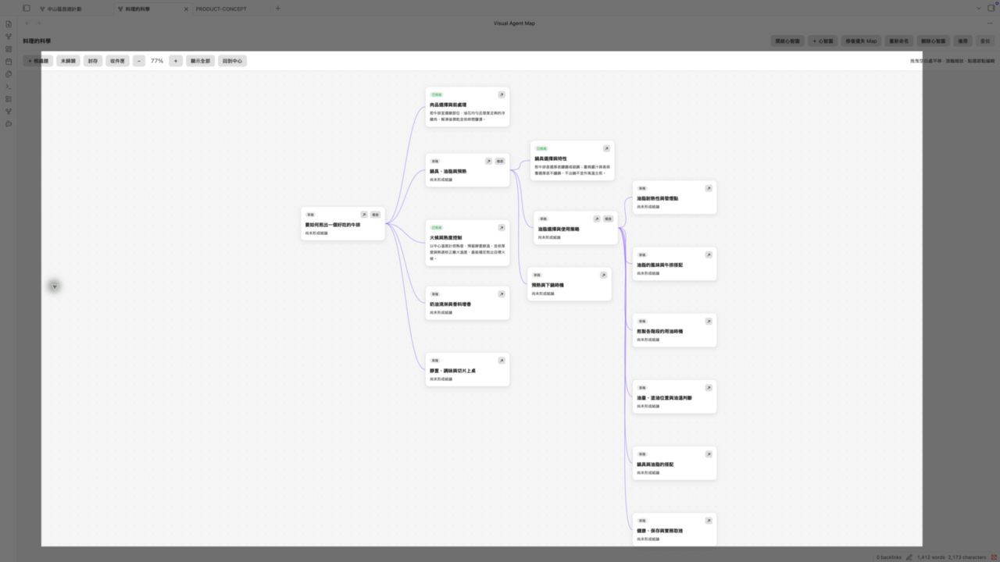

# Visual Agent Map

[English](#english) · [繁體中文](#繁體中文)

## English

### Visual AI research for Obsidian

**Turn complex questions into a visual research map. Explore each branch with Codex. Keep every result as editable Markdown.**

[**Install Visual Agent Map**](#install)

**See the whole question.** Break a broad topic into connected ideas you can navigate at a glance.

**Research one branch at a time.** Run focused Codex tasks from the map, preview suggested subtopics, and review synthesis drafts before saving.

**Keep what you learn.** Each topic is a normal Markdown note in your Obsidian vault, readable and editable without the plugin.

**Uses your local ChatGPT Codex login. No separate API key required.**

### How it works

1. Create a map for a question and add topics or ask Codex to suggest subtopics.
2. Choose a topic and confirm a focused research task.
3. Read the summary on the map and the full result in its Markdown note.
4. Follow the next question or synthesize related findings.

Research and map expansion use web-enabled Codex tasks. Synthesis uses direct child topics and notes selected for that run without requesting web search. Tasks may consume your signed-in account's Codex allowance.

### Install

In **Obsidian Desktop → Settings → Community plugins → Browse**, search for **Visual Agent Map** and install it.

**Requirements:** Obsidian Desktop `1.13.7` or later and a locally installed [Codex CLI](https://developers.openai.com/codex/cli/) signed in with ChatGPT. ChatGPT Free is supported with a smaller Codex allowance. This is a desktop-only plugin; npm is needed only to build from source. Current version: **0.9.5**.

For manual installation, download `main.js`, `manifest.json`, and `styles.css` from the same [GitHub Release](https://github.com/kevcltsai/visual-agent-map/releases), place them in `<your-vault>/.obsidian/plugins/visual-agent-map/`, and preserve any existing `data.json`. Reload Obsidian, enable the plugin, then confirm the Codex CLI path and App Server status in its settings. Do not install files from a branch, copy the repository into the plugin folder, or run `npm install` there. See [INSTALL.md](INSTALL.md) for first-use steps.

### Your notes and privacy

The plugin stores its workspace under `Agent Workspace/` in your vault. Map structure lives in `Map.md`; topic content stays in ordinary Markdown notes. A fresh install creates an empty workspace and opens a read-only sample. Uninstalling the plugin does not delete your notes.

- No telemetry or stored API keys.
- Before the first AI task, the plugin explains that it uses your Codex allowance. Relevant topic content, task instructions, and excerpts from sources selected for that run are sent to the locally signed-in Codex tool.
- AI request and reply logging is off by default. If enabled, recent exchanges are saved in the vault's plugin data and can be cleared.
- The plugin starts `codex app-server` outside the vault in a read-only sandbox without command or file-change approvals. It does not install or update Codex CLI. Remote Markdown images follow Obsidian's normal image-loading behavior.

### Current limitations

Desktop only. There is no node search, multiple parents, or persistent task history. Undo and redo last for the current Obsidian session. A running node task can be stopped while preserving its existing note; after three minutes, the plugin attempts to interrupt it and does not apply incomplete results.

See the [changelog](CHANGELOG.md) for version history and [setup instructions](INSTALL.md) for more detail. This project is developed with [OpenAI Codex](https://openai.com/codex/) as a coding collaborator; the maintainer manages product direction, validation, and releases.

### License

Copyright © 2026 Kevin Tsai. Licensed under [AGPL-3.0-only](LICENSE).

---

## 繁體中文

### 為 Obsidian 打造的視覺化 AI 研究工具

**把複雜問題變成研究地圖，用 Codex 逐一探索分支，並將成果保留為可編輯的 Markdown 筆記。**

[**安裝 Visual Agent Map**](#安裝)

**看清整個問題。** 把大主題拆成彼此連結的議題，一眼掌握研究方向。

**一次研究一個分支。** 從地圖執行聚焦的 Codex 任務，預覽子議題建議，確認整合草稿後再儲存。

**留下真正可用的知識。** 每個議題都是 Obsidian Vault 中的一般 Markdown 筆記，離開外掛也能閱讀與編輯。

**使用本機 ChatGPT Codex 登入狀態，無須另外設定 API key。**

### 使用方式

1. 為問題建立地圖，手動加入議題或讓 Codex 建議子議題。
2. 選擇一個議題並確認聚焦的研究任務。
3. 在地圖看摘要，在 Markdown 筆記讀完整結果。
4. 繼續追問，或整合相關發現。

研究與展開地圖使用可搜尋網頁的 Codex 任務。整合發現只使用直屬子議題與本次選取的筆記，不要求網頁搜尋。任務會使用登入帳號的 Codex 額度。

### 安裝

在 **Obsidian 桌面版 → 設定 → 第三方外掛 → 瀏覽** 搜尋並安裝 **Visual Agent Map**。

**系統需求：** Obsidian 桌面版 `1.13.7` 或更新版本，以及本機已安裝、並以 ChatGPT 登入的 [Codex CLI](https://developers.openai.com/codex/cli/)。ChatGPT Free 可使用，但 Codex 額度較少。外掛僅支援桌面版；只有從原始碼建置才需要 npm。目前版本：**0.9.5**。

若要手動安裝，請從同一個 [GitHub Release](https://github.com/kevcltsai/visual-agent-map/releases) 下載 `main.js`、`manifest.json`、`styles.css`，放入 `<你的-vault>/.obsidian/plugins/visual-agent-map/`，並保留既有的 `data.json`。重新載入 Obsidian、啟用外掛，再於設定確認 Codex CLI 路徑及 App Server 狀態。不要使用 branch 上的檔案、複製整個 repository 至外掛資料夾，或在該資料夾執行 `npm install`。首次使用步驟請見 [INSTALL.md](INSTALL.md)。

### 筆記與隱私

外掛工作區位於 Vault 的 `Agent Workspace/`。地圖結構保存在 `Map.md`，議題內容則是一般 Markdown 筆記。全新安裝會建立空白工作區並開啟唯讀範例；移除外掛不會刪除筆記。

- 不含遙測，也不儲存 API key。
- 首次 AI 任務前會告知使用 Codex 額度。相關議題內容、任務指令及本次選取來源的摘錄會送交本機已登入的 Codex 工具。
- AI 請求與回覆紀錄預設關閉；啟用後，最近的往返紀錄會保存在 Vault 的外掛資料中，並可清除。
- 外掛在 Vault 外以唯讀 sandbox、禁止命令與檔案修改核准的設定啟動 `codex app-server`，不會自行安裝或更新 Codex CLI。Markdown 中的遠端圖片依 Obsidian 一般行為載入。

### 目前限制

僅支援桌面版。尚無節點搜尋、多母議題或永久任務歷史。復原與重做只保留於目前 Obsidian 工作階段。執行中的節點任務可停止，原筆記會保留；超過三分鐘時，外掛會嘗試中斷，未完成的結果不會套用。

版本紀錄請見 [CHANGELOG.md](CHANGELOG.md)，其他設定資訊請見 [INSTALL.md](INSTALL.md)。本專案使用 [OpenAI Codex](https://openai.com/codex/) 協助開發；產品方向、驗證與發布由維護者負責。

### 授權

Copyright © 2026 Kevin Tsai. 採用 [AGPL-3.0-only](LICENSE) 授權。
