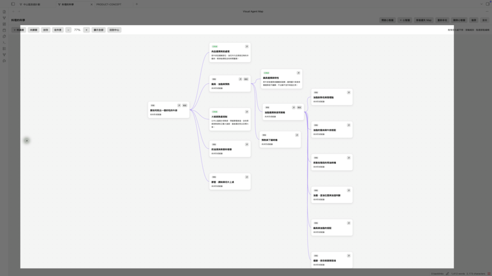

# Visual Agent Map

[English](#english) · [繁體中文](#繁體中文)

## English

### Visual AI research for Obsidian

**Turn complex questions into visual research maps. Explore each branch with Codex. Keep every result as editable Markdown.**

**Works with your ChatGPT Codex login. No separate API key required.**

[**Install Visual Agent Map**](#install)

**See the whole question.** Turn a broad topic into connected ideas you can explore at a glance.

**Research one branch at a time.** Ask focused questions, preview suggested subtopics, and review synthesis drafts before saving.

**Keep what you learn.** Your research stays in ordinary Markdown notes you can read and edit without the plugin.

### Coffee Tables — new in the development build

**Bring a question to a table of simulated AI guests.** Hosts help different perspectives respond to one another, so you can notice blind spots, unexpected connections, and better questions—not just collect separate answers.

- Choose guest perspectives and counts, then watch one natural, streaming conversation take shape.
- Listen in, add a comment, ask a guest a question, or redirect the discussion. Continue a finished table or follow up in the same conversation.
- Review observer notes that evolve with the discussion, including key turns, open questions, and unresolved disagreements.
- Find and revisit tables with search and status filters. Conversations and notes are saved as Markdown; resumable session data is kept separately.
- The interface is available in English and Traditional Chinese. AI guests and their experiences are simulations, not real people or verified experts.

Coffee Tables is available from the Coffee Tables ribbon icon or the **Open Coffee Tables** command in the current development build. It is **not included in the 0.9.10 release** linked in the install instructions above.

### How it works

**Question → Map → Research → Expand**

Create a map → add topics or ask AI for suggestions → research a node → review the result → follow the next question.

### Install

Search for **Visual Agent Map** in **Obsidian → Settings → Community plugins → Browse**, then install and enable it.

**Version 0.10.0 · Obsidian Desktop 1.13.7+**. Manual maps work without AI. For AI tasks, install [Codex CLI](https://developers.openai.com/codex/cli/), sign in with ChatGPT, and check its status in VAM settings. [Claude Code](https://docs.anthropic.com/en/docs/claude-code/overview) is also available as an experimental alternative with its own account.

**Manual install:** Download `main.js`, `manifest.json`, and `styles.css` from the same [GitHub Release](https://github.com/kevcltsai/visual-agent-map/releases/latest). Place them in `<your-vault>/.obsidian/plugins/visual-agent-map/`, preserve existing `data.json`, then reload Obsidian and enable VAM. Use release files, not a repository checkout. Setup help: [INSTALL.md](INSTALL.md).

### Highlights

AI subtopic suggestions · Focused research · Research synthesis · Searchable topic outline · Built-in Taiwan travel sample

### Your notes and privacy

Your workspace stays in `Agent Workspace/`: `Map.md` holds the map, and each topic is a Markdown note. Uninstalling VAM does not delete your notes.

- **No telemetry or stored API keys.** AI tasks send relevant topic content, instructions, and selected sources through your local CLI to OpenAI or Anthropic; they may use your account's allowance and incur provider charges.
- Research can search the web; synthesis uses your selected knowledge, with web search off by default. AI request/reply logging is off by default; enabled logs stay in the vault's plugin data and can be cleared.

Local access and permissions

VAM launches your configured CLI from the plugin directory. Codex uses a read-only App Server thread; Claude uses structured output with user settings and MCP disabled and tools restricted. Both inherit Obsidian's OS permissions and environment: CLI restrictions are not an OS sandbox. Use trusted executables; VAM never installs or updates them.

Node filesystem APIs probe CLI paths outside the vault and save AI exchanges, pending suggestions, and temporary files in the plugin directory. Workspace discovery scans vault Markdown paths and may read notes to identify VAM data; this does not send the whole vault to AI. Selected external Markdown sources remain outside the vault. Copy buttons only write selected logs to the clipboard. Remote Markdown images follow Obsidian's normal loading behavior.

### Current limitations

Desktop only; currently verified on macOS. Claude Code is experimental, with successful live tasks still unverified. Models, web access, and answer quality depend on your CLI and account. Outline search covers topic titles in the current map only. No multiple parents or persistent task history; undo/redo is temporary. Switching maps or closing the map view clears its ordinary edit history. Stopping a task preserves existing notes. VAM attempts to interrupt tasks after three minutes and does not apply incomplete results.

### License

Copyright © 2026 Kevin Tsai · [AGPL-3.0-only](LICENSE) · [Changelog](CHANGELOG.md)

---

## 繁體中文

### 為 Obsidian 打造的視覺化 AI 研究工具

**把複雜問題變成研究地圖，用 Codex 逐一探索分支，並將成果保留為可編輯的 Markdown 筆記。**

**沿用你的 ChatGPT Codex 登入狀態，無須另外設定 API key。**

[**安裝 Visual Agent Map**](#安裝)

**看清整個問題。** 把大主題拆成彼此連結的議題，一眼掌握研究方向。

**一次研究一個分支。** 聚焦提問、預覽子議題建議，確認整合草稿後再儲存。

**留下真正可用的知識。** 研究成果就是一般 Markdown 筆記，離開外掛也能閱讀與編輯。

### Coffee Tables — 開發版新功能

**帶一個問題來，讓不同觀點的 AI 來賓一起聊。** 主持人協助來賓彼此回應，幫你發現盲點、意外連結和更值得追問的問題，而不只是收集一排各自獨立的答案。

- 選擇來賓視角與人數，觀看模型以串流方式自然安排對談。
- 可以旁聽、加入想法、追問特定來賓或改變方向；一場桌聊結束後也能在同一串對話繼續聊。
- 觀察者整理會隨討論更新，記下重要轉折、值得追問的問題及尚未解決的分歧。
- 透過搜尋與狀態篩選找回桌聊。對談與筆記保存為 Markdown；可恢復的工作階段資料另行保存。
- 介面支援繁體中文與英文。AI 來賓及其經驗皆為模擬，不是真實人物或經查證的專家。

目前可在開發版透過 Coffee Tables 咖啡杯圖示或 **Open Coffee Tables** 命令開啟。**此功能尚未包含在上方連結的 0.9.10 正式版中。**

### 使用方式

**問題 → 地圖 → 研究 → 展開**

建立地圖 → 加入議題或讓 AI 提出建議 → 研究一個節點 → 檢視結果 → 繼續追問。

### 安裝

在 **Obsidian → 設定 → 第三方外掛 → 瀏覽** 搜尋 **Visual Agent Map**，安裝並啟用。

**版本 0.10.0 · Obsidian 桌面版 1.13.7+**。手動建立地圖不需要 AI；執行 AI 任務前，請安裝 [Codex CLI](https://developers.openai.com/codex/cli/)、以 ChatGPT 登入，並在 VAM 設定確認狀態。也可使用實驗性支援的 [Claude Code](https://docs.anthropic.com/en/docs/claude-code/overview)，須登入對應帳號。

**手動安裝：** 從同一個 [GitHub Release](https://github.com/kevcltsai/visual-agent-map/releases/latest) 下載 `main.js`、`manifest.json`、`styles.css`，放入 `<你的-vault>/.obsidian/plugins/visual-agent-map/`，保留既有 `data.json`，再重新載入 Obsidian 並啟用。請使用正式發布檔案，勿直接複製 repository。設定指南：[INSTALL.md](INSTALL.md)。

### 功能亮點

AI 子議題建議 · 聚焦研究 · 研究成果整合 · 可搜尋的議題大綱 · 內建台灣旅遊範例

### 筆記與隱私

工作區保存在 Vault 的 `Agent Workspace/`：`Map.md` 記錄地圖，每個議題都是 Markdown 筆記。移除 VAM 不會刪除筆記。

- **不含遙測，也不儲存 API key。** AI 任務會透過本機 CLI，將相關議題內容、指令及選取來源送至 OpenAI 或 Anthropic；可能使用帳號額度並產生服務費用。
- 研究可搜尋網頁；整合使用你選定的知識，網頁搜尋預設關閉。AI 請求／回覆紀錄預設關閉；啟用後保存在 Vault 的外掛資料中，可自行清除。

本機存取與權限細節

VAM 以外掛目錄為工作目錄啟動你設定的 CLI。Codex 使用唯讀 App Server 工作階段；Claude 使用結構化輸出，停用使用者設定與 MCP 並限制工具。兩者仍繼承 Obsidian 的作業系統權限與環境，CLI 限制不等於 OS sandbox。請使用可信任的執行檔；VAM 不會自行安裝或更新 CLI。

Node 檔案 API 會探測 Vault 外的 CLI 路徑，並在外掛目錄保存 AI 往返紀錄、待確認建議與暫存檔。工作區探索會列舉 Vault 的 Markdown 路徑，並可能讀取筆記以辨識 VAM 資料；這不代表將整個 Vault 傳給 AI。選取的外部 Markdown 來源仍留在 Vault 外。複製按鈕只將選定日誌寫入剪貼簿；遠端 Markdown 圖片依 Obsidian 一般行為載入。

### 目前限制

僅支援桌面版，目前已驗證環境為 macOS。Claude Code 屬實驗性支援，成功真實任務仍待驗證。模型、網頁存取與回答品質取決於 CLI 與帳號。大綱只搜尋目前地圖的議題名稱。尚無多母議題或永久任務歷史；復原／重做為暫存紀錄，切換地圖或關閉地圖檢視會清除一般編輯歷史。停止任務會保留原筆記；超過三分鐘會嘗試中斷，未完成的結果不會套用。

### 授權

Copyright © 2026 Kevin Tsai · [AGPL-3.0-only](LICENSE) · [版本紀錄](CHANGELOG.md)
