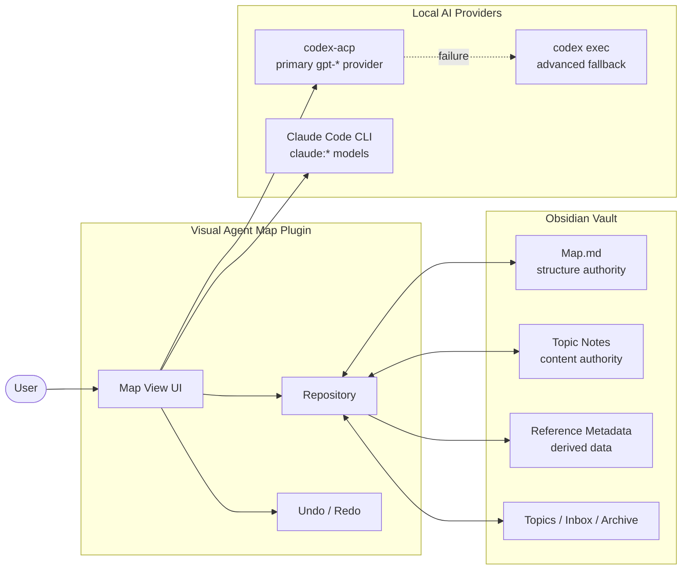

# System Overview

Visual Agent Map 是一個 Obsidian 桌面外掛：圖面結構由 `Map.md` 管理，議題內容由 Markdown 筆記管理，AI 任務透過本機已登入的 Codex / Claude 工具執行。

## Responsibilities

- `Map.md`：唯一決定節點、座標、父子關係、收合與 viewport 的結構來源。
- Topic Notes：保存議題、目前理解、AI 規則、User Notes、Detail、Model 與 ownership。
- Repository：負責資料讀寫、遷移、reference metadata 重建與 topic lifecycle。
- AI providers：`gpt-*` 預設走 `codex-acp`；ACP 失敗時才使用 `codex exec` fallback；`claude:*` 走 Claude Code CLI。
