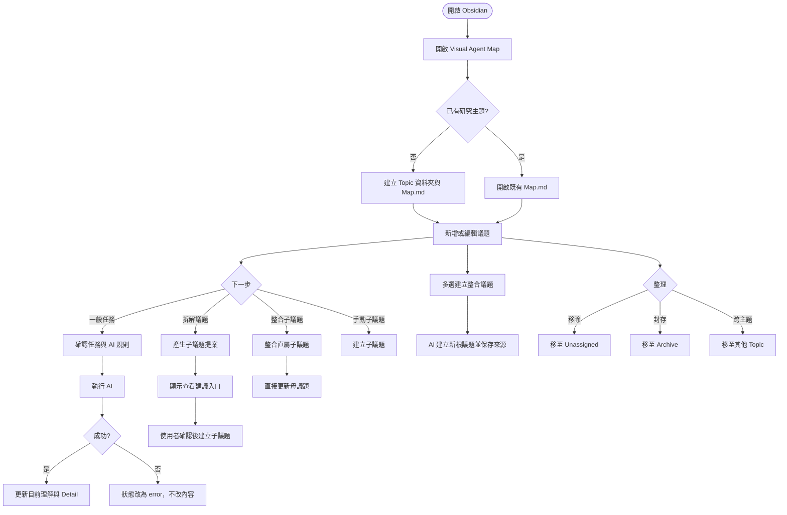

# Flow and Interaction

本文件合併使用者流程與 AI 任務互動。重點是：圖面操作必須保護 Markdown 內容；AI 成功才寫回，失敗只改狀態。

## User Flow



## AI Interaction

```mermaid
sequenceDiagram
  autonumber
  actor User
  participant View as Map View
  participant Repo as Repository
  participant Note as Topic Note
  participant ACP as codex-acp
  participant Codex as codex exec fallback
  participant Claude as Claude Code CLI

  User->>View: 執行一般任務 / Decompose / Synthesize
  View->>Repo: readNote + read task context
  Repo->>Note: 讀取 frontmatter 與 sections
  Note-->>Repo: note content
  Repo-->>View: current note + ancestors/sources/children
  View->>View: 組裝 TaskContext 與 JSON schema

  alt claude:* model
    View->>Claude: claude --model --json-schema
    Claude-->>View: structured JSON
  else gpt-* model
    View->>ACP: initialize/session/prompt
    alt ACP success
      ACP-->>View: structured JSON
    else ACP failure
      View->>Codex: codex exec --output-schema --sandbox read-only
      Codex-->>View: structured JSON
    end
  end

  alt success
    View->>Repo: update summary/detail/status
    Repo->>Note: write managed fields only
  else failure
    View->>Repo: update status=error
    Repo->>Note: preserve user content
  end
```

## Task Types

| Type | Context | Reasoning | Writeback |
|---|---|---:|---|
| General task | current note + ancestors + saved sources | low | 更新 summary / Detail；suggestions 只暫存 |
| Decompose | current note + light context | low | 不改內容；只產生待確認子議題提案 |
| Synthesize | parent + direct children | high | 直接更新母議題 summary / Detail |
