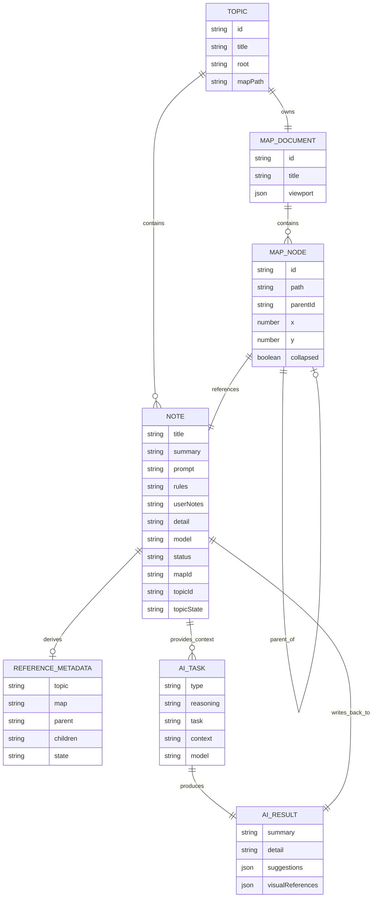

# Data Model

`MapDocument` 決定圖面結構；`Note` 保存研究內容；reference metadata 是可重建的衍生資料。

## Core Fields

- `Status`: `idea`, `running`, `completed`, `error`
- `TopicState`: `active`, `unassigned`, `archived`, `inbox`
- `ModelSource`: `workspace`, `inherited`, `manual`
- `Settings`: 保存 workspace 路徑、provider 路徑、預設 model、model menu 與 hover preview scale。
- `Detail`: 保存固定六段知識頁；視覺參考寫入 Detail 內的「視覺參考」段落。
- `User Notes`: 使用者自由編輯區，AI 任務不得覆蓋。
