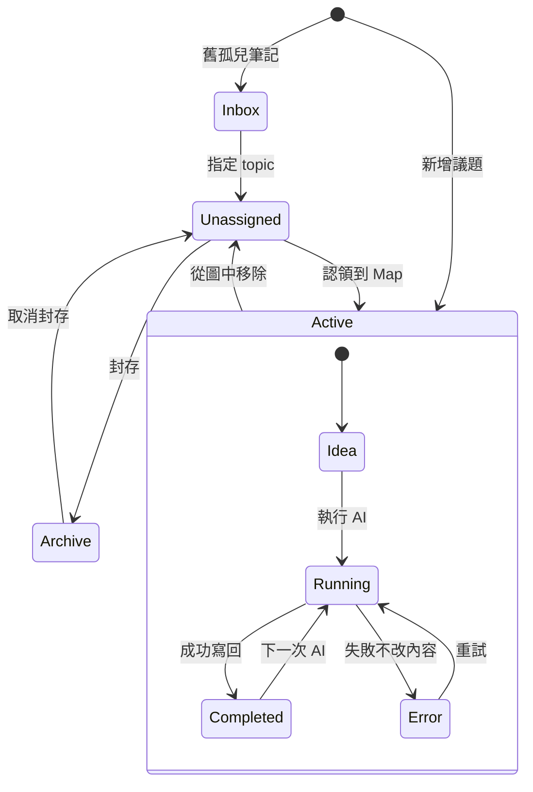

# Key Rules

這份只保留不可違反的資料與行為規則；操作細節放在 README / PRODUCT-CONCEPT。

## Authority

- `Map.md` 是圖面結構唯一權威。
- Topic Note 是議題內容權威。
- Reference metadata 與 `[[wikilink]]` 是衍生資料，可重建，不可反向決定 parent / child。
- 開啟心智圖是 read-only 行為，不得自動改寫議題筆記。

## Ownership and Lifecycle

- 一份 Note 同一時間只能屬於一張 Map。
- Active Note 位於 `Notes` 並被 `Map.md` 引用。
- 從圖中移除時，Note 移至同 topic 的 `Unassigned`，保留 `topic-id`，清除 `agent-map-id`。
- Archive 只能從 Unassigned 進入；回到圖上前必須先取消封存。
- Inbox 只保存無法判斷原 topic 的孤兒筆記；程式不得猜測。

## Parent / Child

- 父子關係必須無循環。
- 每個節點至多一個母議題。
- 子議題建立時複製母議題當下的 Model 與 AI 規則；建立後不持續同步。
- 一般 AI 任務帶入所有 ancestors 的 title / summary / rules。
- 子議題結果不得自動覆寫母議題；必須透過 Synthesize。

## AI Writeback

- AI 成功才可更新 summary / Detail / status。
- AI 失敗只能將 status 改為 `error`，不得改寫 summary、Detail、Prompt 或 User Notes。
- General task：直接更新目前理解與 Detail；suggestions 只暫存，不自動建立節點。
- Decompose：不自動跳窗、不自動建立節點；使用者確認後才建立子議題。
- Synthesize：執行前確認，成功後直接更新母議題。
- 視覺參考寫入 Detail 內的「視覺參考」段落，不建立獨立 `Visual References` section。

## User Content Protection

- `User Notes` 不得被 AI 任務或整合流程覆蓋。
- 外掛只修改自己管理的 frontmatter 欄位與明確管理的 sections。
- Reference rebuild 只改 `agent-map-references` metadata；舊版 body marker 只在遷移或整理時移除。
- 外部檔案與畫面同時修改時，必須提示衝突，不得用最後寫入者直接覆蓋。
